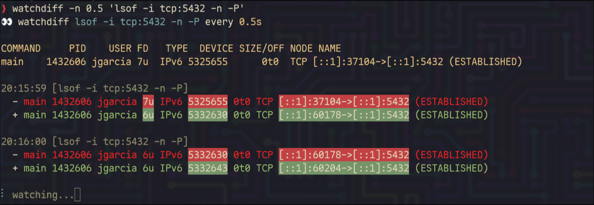

# watchdiff 👀

A tiny CLI tool that watches a command and only prints what changed — with color.

No screen clearing, no full redraws. Just a clean stream of diffs with word-level highlighting.



## Install

```bash
go install github.com/bechampion/watchdiff@latest
```

Or build from source:

```bash
git clone https://github.com/bechampion/watchdiff.git
cd watchdiff
go build -o watchdiff .
sudo cp watchdiff /usr/local/bin/
```

## Usage

```bash
watchdiff [-n seconds] command
```

| Flag | Description | Default |
|------|-------------|---------|
| `-n` | Interval between runs (supports decimals) | `1` |

## What it does

1. Runs your command, prints the initial output in yellow
2. Re-runs on a loop, diffs each output against the previous
3. Pairs similar lines and highlights the **specific words** that changed
4. Pure additions/removals shown in full color
5. Spins quietly between changes

**Red background** = the old value that changed  
**Green background** = the new value that replaced it  
Dim red/green = unchanged context within a modified line

## Examples

### Watch database connections

```bash
watchdiff -n 0.5 'lsof -i tcp:5432 -n -P'
```

```
👀 watchdiff lsof -i tcp:5432 -n -P every 0.5s

COMMAND   PID    USER FD  TYPE  DEVICE NODE NAME
main  1432606 jgarcia  7u  IPv6 5325655  TCP [::1]:37104->[::1]:5432 (ESTABLISHED)

20:15:59 [lsof -i tcp:5432 -n -P]
  - main 1432606 jgarcia 7u IPv6 5325655 0t0 TCP [::1]:37104->[::1]:5432 (ESTABLISHED)
  + main 1432606 jgarcia 6u IPv6 5332630 0t0 TCP [::1]:60178->[::1]:5432 (ESTABLISHED)
                         ^^      ^^^^^^^          ^^^^^^^^^^^^^^^^^^^^^^^^
                         only the changed words get a background highlight
```

### Watch pods cycle

```bash
watchdiff -n 2 'kubectl get pods --no-headers'
```

```
👀 watchdiff kubectl get pods --no-headers every 2.0s

api-7b4f8c9d6-x2k9m   1/1   Running   0   4h
api-7b4f8c9d6-n8p3w   1/1   Running   0   2h

14:35:22 [kubectl get pods --no-headers]
  - api-7b4f8c9d6-x2k9m   1/1   Running   0   4h
  + api-7b4f8c9d6-q7r2t   0/1   Pending   0   1s
```

### Watch processes

```bash
watchdiff 'ps aux | grep postgres | grep -v grep'
```

### Watch files

```bash
watchdiff -n 0.5 'ls -la /tmp/uploads/'
```

### Empty output

If the command returns nothing, watchdiff shows:

```
👀 watchdiff cat /dev/null every 1.0s

--no output--
```

## License

MIT
